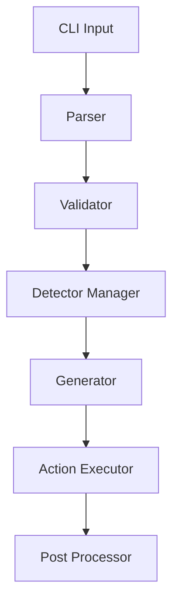

# Forge Tree

[](https://badge.fury.io/js/forge-tree)
[](https://opensource.org/licenses/MIT)
[](https://nodejs.org)

A powerful tool to scaffold project structures from ASCII tree diagrams. Supports smart detection of project types, custom templates, and extensive configuration options.

## Documentation

### Getting Started
- [Installation and Basic Usage](#installation)
- [Quick Start Guide](#quick-start)
- [Command Line Options](#command-line-options)

### Core Concepts
- [Tree File Format](#tree-file-format)
- [Path Handling Guide](docs/path-handling.md)
- [Validation Rules](docs/path-handling.md#validation-rules)
- [Conflict Resolution](docs/path-handling.md#conflict-resolution)

### Logging and Analysis
- [Log Viewer Guide](docs/log-viewer.md)
  - [Quick Start](docs/log-viewer.md#quick-start)
  - [Features](docs/log-viewer.md#features)
  - [File Formats](docs/log-viewer.md#file-formats)
  - [Cache Management](docs/log-viewer.md#cache-management)
  - [Keyboard Shortcuts](docs/log-viewer.md#keyboard-shortcuts)
  - [Customization](docs/log-viewer.md#customization)
  - [Troubleshooting](docs/log-viewer.md#troubleshooting)
- [Browser Configuration](docs/browser-config.md)

### Example Configurations
- [Monorepo Setup](docs/examples/monorepo.md)
- [Next.js Application](docs/examples/next-app.md)
- [Microservices Architecture](docs/examples/microservices.md)

### Advanced Topics
- [Custom Initializers](#custom-initializers)
- [Smart Detectors](#smart-detectors)
- [Statistics and Analysis](#statistics-output)
- [Generated Structure](#generated-structure-display)

### Guides and References
- [Troubleshooting Guide](docs/troubleshooting.md)
- [Path Handling Guide](docs/path-handling.md)
- [Error Messages](#error-handling)
- [Best Practices](docs/troubleshooting.md#best-practices)

### Development
- [Architecture Overview](#architecture)
- [Adding Features](#adding-features)
- [Testing Guide](#testing)
- [Scripts and Commands](#scripts)

## Features

- 🌳 Parse ASCII tree diagrams into real directory structures
- 🔍 Smart project type detection (Next.js, Firebase, etc.)
- 🎨 Support for multiple tree styles and formats
- 📝 Extensive commenting capabilities
- 🛠️ Custom initializers and templates
- 📊 Detailed project statistics
- 📋 Progress tracking and validation
- 🔄 Git integration

## Requirements

- Node.js >= 18.0.0

## Installation

```bash
# Global installation (recommended)
npm install -g forge-tree

# Local installation
npm install forge-tree

# Development setup
git clone https://github.com/Cleman25/forge-tree.git
cd forge-tree
npm ci
npm run build
npm link  # Makes the CLI available globally
```

## Quick Start

```bash
# Create a new project
forge-tree my-project --tree "my-project/\n  src/\n  package.json"

# Use a tree file
forge-tree --tree-file project.tree

# Enable all features
forge-tree --detectors --dotfiles --git

# Create GitHub repo
forge-tree my-project --github --private
```

## Basic Usage

```bash
forge-tree [targetDir] --tree-file path/to/tree.txt
# or
forge-tree [targetDir] --tree "root/\n  child/"
```

## Tree File Format

### Basic Structure

```
project/
├─ src/
│  ├─ index.ts
│  └─ types.ts
├─ test/
│  └─ index.test.ts
└─ package.json
```

### Alternative Styles

Simple style:
```
project/
- src/
  - index.ts
  - types.ts
- test/
  - index.test.ts
- package.json
```

Custom characters:
```
project/
+-- src/
|   +-- index.ts
|   `-- types.ts
+-- test/
|   `-- index.test.ts
`-- package.json
```

### Comments

Multiline comments at start/end:
```
"""
Project description
Multiple lines allowed
"""
project/
├─ src/
│  ├─ index.ts  # Main entry
│  └─ types.ts  // Type definitions
├─ test/        /* Test directory */
└─ package.json

/*
Additional notes
Can go here
*/
```

Alternative comment styles:
```
#
Project description
Using hash style
#
project/
...

/**
 * Project description
 * Using JSDoc style
 */
project/
...
```

## Smart Detectors

Built-in detectors automatically set up:

### Web Applications
- Next.js apps (`web`, `app`, `frontend` directories)
- Firebase projects (`firebase`, `functions` directories)

### Services
- Backend services (`service`, `api`, `server` directories)
- Real-time services (`realtime`, `socket` directories)

### Libraries
- TypeScript libraries (`lib`, `package`, `sdk` directories)
- UI components (`ui`, `components`, `design-system` directories)

### Infrastructure
- Database setup (`db`, `database`, `sql`, `mongo` directories)
- Docker/K8s (`infra`, `deploy`, `ops` directories)

### Configuration
- TypeScript config (`config`, `tsconfig` directories)
- ESLint/Prettier (`eslint`, `prettier` directories)

## Custom Initializers

### Adding Initializers via CLI

```bash
# Add a new initializer
forge-tree --add-init \
  --init-id "redis-init" \
  --init-name "Redis Setup" \
  --init-desc "Initialize Redis with default config" \
  --init-cmd "redis-cli" \
  --init-args "ping" \
  --init-match-dirs "redis,cache" \
  --init-match-files "redis.conf" \
  --init-env "REDIS_PORT=6379" \
  --init-workdir "target"

# Add target directories for an initializer
forge-tree --add-init-target \
  --init-id "redis-init" \
  --target-dirs "services/cache,infra/redis"

# List all initializers
forge-tree --list-init

# Remove an initializer
forge-tree --remove-init "redis-init"
```

### Configuration File

You can also define initializers in your config:

```json
{
  "customInitializers": [
    {
      "id": "redis-init",
      "name": "Redis Setup",
      "description": "Initialize Redis with default config",
      "command": "redis-cli",
      "args": ["ping"],
      "matchDirs": ["redis", "cache"],
      "matchFiles": ["redis.conf"],
      "env": {
        "REDIS_PORT": "6379"
      },
      "workingDir": "target"
    }
  ],
  "initTargets": [
    {
      "initId": "redis-init",
      "targetDirs": ["services/cache", "infra/redis"]
    }
  ]
}
```

### Using Custom Initializers

```bash
# Use specific initializers
forge-tree --tree-file project.tree --use-init "redis-init,mongo-init"

# Skip specific initializers
forge-tree --tree-file project.tree --skip-init "firebase-init"

# Run only custom initializers
forge-tree --tree-file project.tree --only-custom-init
```

## Configuration Options

### Command Line Options

```bash
Options:
  --tree-file             Path to ASCII tree file
  --tree                  ASCII tree string (quoted)
  --targetDir            Where to scaffold (default: ".")
  --tabIndentationSize   Spaces per depth level (default: 2)
  --detectAsciiGuides    Skip │ ├ └ guides (default: true)
  --dry-run             Print actions only
  --yes, -y             Assume yes for prompts
  --pm                  Preferred package manager (pnpm|yarn|npm)
  --detectors           Enable smart detectors (default: true)
  --dotfiles           Generate ignores/formatters (default: true)
  --git                Initialize git repo
  --github             Create GitHub repo
  --private            Create private GitHub repo
  --no-push            Don't push after creating remote
  --branch             Initial branch name (default: "main")
  --log                Enable logging (default: true)
  --log-file           Log file path
  --log-level          Log level (silent|error|warn|info|debug|verbose)
  --log-format         Log format (text|json)
  --quiet              Suppress console output
  --show-tree         Show input tree structure (default: true)
  --show-result       Show generated structure (default: true)
  --allowNestedInit   Allow initialization in nested directories

Initializer Management:
  --add-init          Add a new custom initializer
  --init-id           ID for the new initializer
  --init-name         Display name for the initializer
  --init-desc         Description of what the initializer does
  --init-cmd          Command to run
  --init-args         Command arguments (comma-separated)
  --init-match-dirs   Directories to match (comma-separated)
  --init-match-files  Files to check for (comma-separated)
  --init-env          Environment variables (KEY=VALUE,...)
  --init-workdir      Working directory (root|target)
  --add-init-target   Add target directories for an initializer
  --target-dirs       Directories to target (comma-separated)
  --list-init         List all available initializers
  --remove-init       Remove a custom initializer
  --use-init          Use specific initializers (comma-separated)
  --skip-init         Skip specific initializers (comma-separated)
  --only-custom-init  Run only custom initializers
```

### Tree Style Configuration

```json
{
  "treeStyle": {
    "indent": "  ",
    "vertical": "│",
    "horizontal": "─",
    "corner": "└",
    "branch": "├"
  }
}
```

### Logging Configuration

```json
{
  "logging": {
    "enabled": true,
    "level": "info",
    "file": "forge-tree.log",
    "console": true,
    "format": "text",
    "includeTimestamps": true,
    "includeDuration": true,
    "includeMetadata": true
  }
}
```

## Example Structures

### Monorepo Setup
```
monorepo/
├─ apps/
│  ├─ web/
│  │  ├─ src/
│  │  └─ package.json
│  └─ api/
│     ├─ src/
│     └─ package.json
├─ packages/
│  ├─ ui/
│  │  ├─ src/
│  │  └─ package.json
│  └─ utils/
│     ├─ src/
│     └─ package.json
├─ config/
│  ├─ tsconfig/
│  └─ eslint/
└─ package.json
```

### Next.js Project
```
web-app/
├─ app/
│  ├─ layout.tsx
│  ├─ page.tsx
│  └─ blog/
│     └─ [slug]/
│        └─ page.tsx
├─ components/
│  └─ Button.tsx
├─ lib/
│  └─ utils.ts
└─ package.json
```

### Backend Service
```
service/
├─ src/
│  ├─ index.ts
│  ├─ routes/
│  ├─ models/
│  └─ utils/
├─ test/
│  └─ api.test.ts
├─ prisma/
│  └─ schema.prisma
└─ package.json
```

## Statistics and Analysis

The tool provides comprehensive logging and analysis capabilities through its built-in log viewer:

### Log Viewer
- **Real-time Monitoring**:
  - Live log tailing with automatic updates
  - In-memory and browser cache storage
  - Automatic visualization switching
  - Status indicators and progress tracking

- **Interactive Visualizations**:
  - Timeline charts with operation durations
  - Treemap views of operation distribution
  - Gantt diagrams for process flow
  - Network graphs for dependencies
  - Auto-updating during tailing
  - Collapsible sections and entries

- **Data Management**:
  - Text and JSON format support
  - Browser localStorage caching
  - No server dependency
  - Automatic data parsing
  - Memory-efficient storage

- **User Interface**:
  - Dark/light theme support
  - Collapsible sections
  - Custom scrollbars
  - Path highlighting
  - Duration formatting
  - Pretty-printed JSON
  - Responsive design

- **Analysis Tools**:
  - Full-text search
  - Log level filtering
  - Performance metrics
  - Success rate tracking
  - Operation statistics
  - Export options (PDF, CSV, JSON)

- **File System Stats**:
  - Directory operations tracking
  - File operation monitoring
  - Initializer success rates
  - Real-time updates
  - Visual progress indicators

### Project Statistics
The tool generates detailed statistics about your project structure:

- Total directories and files
- Maximum directory depth
- Empty directories count
- Average files per directory
- Largest directory
- Root level structure
- Language breakdown
- File categories (source, config, test, etc.)
- File extensions

Statistics are saved to `forge-tree.stats.json` and can be viewed through:
- Console output with progress bars
- Interactive web viewer
- JSON export for further analysis

### Viewing Logs and Stats
```bash
# View both logs and stats
forge-tree view --log --with-stats

# View only logs
forge-tree view --log forge-tree.log

# View only stats
forge-tree view --stats forge-tree.stats.json

# List recent files
forge-tree view --list

# Browser preferences
forge-tree view --browser chrome --incognito
```

See the [Log Viewer Guide](docs/log-viewer.md) for more details.

## Generated Structure Display

After generation, the tool shows:
- The actual generated structure
- Comparison with expected structure
- Missing and additional items
- Completion percentage
- Placeholders for large directories (e.g., `node_modules/`)

## Error Handling

The tool validates:
- Tree structure syntax
- Comment formatting
- Node name validity
- Directory depth consistency
- Path uniqueness
- Comment block closure

## Command Line Help

| Category | Command | Description | Example |
|----------|---------|-------------|---------|
| **Basic Usage** |
| | `--tree` | Direct tree string input | `--tree "root/\n  child/"` |
| | `--tree-file` | Read tree from file | `--tree-file project.tree` |
| | `--targetDir` | Output directory | `--targetDir ./output` |
| **Tree Formatting** |
| | `--tabIndentationSize` | Spaces per level | `--tabIndentationSize 4` |
| | `--detectAsciiGuides` | Parse tree characters | `--detectAsciiGuides false` |
| | `--treeStyle` | Custom tree characters | See Tree Style Configuration |
| **Project Setup** |
| | `--pm` | Package manager | `--pm pnpm` |
| | `--detectors` | Enable smart detection | `--detectors true` |
| | `--dotfiles` | Generate config files | `--dotfiles true` |
| **Git Integration** |
| | `--git` | Initialize repository | `--git` |
| | `--github` | Create GitHub repo | `--github "repo-name"` |
| | `--private` | Private repository | `--private` |
| | `--branch` | Initial branch name | `--branch main` |
| | `--no-push` | Skip initial push | `--no-push` |
| **Logging** |
| | `--log` | Enable logging | `--log true` |
| | `--log-file` | Log file path | `--log-file "forge.log"` |
| | `--log-level` | Log verbosity | `--log-level debug` |
| | `--log-format` | Log output format | `--log-format json` |
| | `--quiet` | Suppress console | `--quiet` |
| **Log Viewer** |
| | `view --log` | View log file | `view --log forge-tree.log` |
| | `view --stats` | View stats file | `view --stats forge-tree.stats.json` |
| | `view --with-log` | Include logs | `view --stats --with-log` |
| | `view --with-stats` | Include stats | `view --log --with-stats` |
| | `view --list` | List recent files | `view --list` |
| | `view --cleanup` | Clean cache | `view --cleanup` |
| | `view --browser` | Browser preference | `view --browser chrome` |
| | `view --incognito` | Private mode | `view --incognito` |
| **Display** |
| | `--show-tree` | Show input structure | `--show-tree` |
| | `--show-result` | Show output structure | `--show-result` |
| **Initialization** |
| | `--allowNestedInit` | Allow nested inits | `--allowNestedInit` |
| | `--add-init` | Add custom initializer | See Custom Initializers |
| | `--use-init` | Use specific inits | `--use-init "redis,mongo"` |
| | `--skip-init` | Skip specific inits | `--skip-init "firebase"` |
| | `--only-custom-init` | Custom inits only | `--only-custom-init` |
| **Other** |
| | `--dry-run` | Preview actions | `--dry-run` |
| | `--yes` | Auto-confirm prompts | `--yes` |
| | `--help` | Show help | `--help` |

## Architecture



## Development Guide

### Adding Features

1. **New Detector**
   ```ts
   export const MyDetector: Detector = {
     id: "my-detector",
     match: (node, cfg) => boolean,
     prompt: async (node) => boolean,
     generate: async (node, cfg) => GeneratorResult
   };
   ```

2. **New Generator**
   ```ts
   export const MyGenerator = {
     createActions: (node: TreeNode): PlanAction[] => {
       return [
         { type: "mkdir", path: "..." },
         { type: "write", path: "...", content: "..." }
       ];
     }
   };
   ```

3. **New Command**
   ```ts
   yargs
     .command('my-command', 'Description', {
       // options
     }, async (argv) => {
       // handler
     });
   ```

### Testing

1. **Unit Tests**
   ```bash
   # Run specific test
   npm test -- src/__tests__/my.test.ts
   
   # Watch mode
   npm run test:watch
   ```

2. **Integration Tests**
   ```bash
   # E2E tests
   npm test -- src/__tests__/e2e.test.ts
   ```

3. **Coverage**
   ```bash
   npm run ci:test
   ```

## Scripts

```bash
# Build the project
npm run build

# Watch mode during development
npm run dev

# Run tests
npm test
npm run test:watch

# Release commands
npm run release:patch  # Bump patch version
npm run release:minor  # Bump minor version
npm run release:major  # Bump major version

# CI/CD commands
npm run ci             # Full CI pipeline
npm run ci:verify     # Run all checks
npm run ci:lint       # Run linting
npm run ci:test       # Run tests with coverage
npm run ci:build      # Production build
npm run ci:clean      # Clean build artifacts
npm run ci:audit      # Security audit

# Local development
npm run local         # Install, build, and link locally
```

## Contributing

Contributions are welcome! Please read our contributing guidelines and submit pull requests to our GitHub repository.

## Support

- Report bugs on our [issue tracker](https://github.com/Cleman25/forge-tree/issues)
- Ask questions using [GitHub Discussions](https://github.com/Cleman25/forge-tree/discussions)

## License

[MIT](LICENSE) © Clement Abel